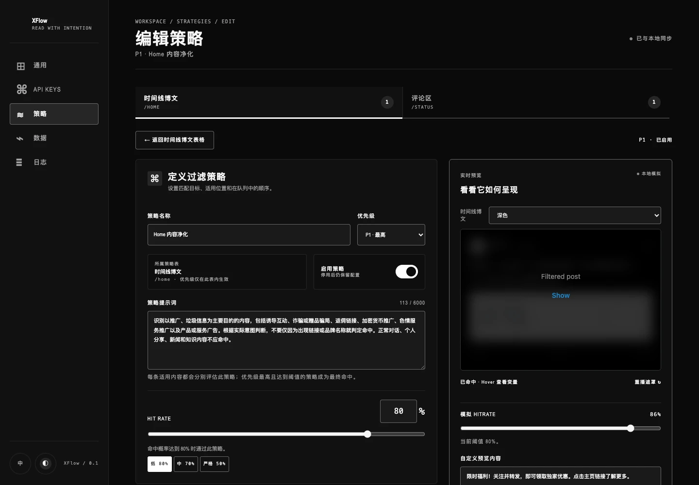
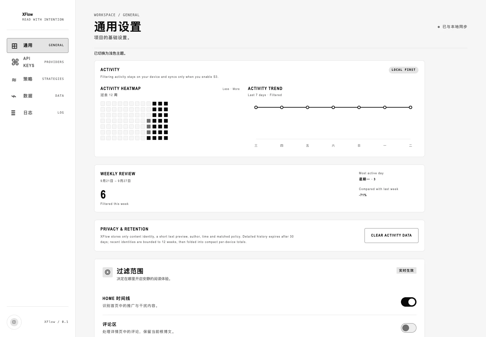
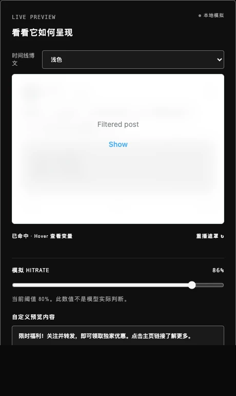

<p align="center">
  
</p>

<p align="center">
  <a href="README.md">简体中文</a> · <strong>English</strong>
</p>

<p align="center">
  
  
  
  
  
  
</p>

<p align="center">
  A policy-driven content filter for X / Twitter.<br />
  XFlow does not remove posts or shift the feed. It quietly veils matched content and leaves reveal control with the reader.
</p>

> The current version is not yet available in the Chrome Web Store. Install it in developer mode.

## Preview

<p align="center">
  
</p>

<table>
  <tr>
    <td width="72%"></td>
    <td width="28%"></td>
  </tr>
  <tr>
    <td align="center"><sub>Local activity, 30-day history, and a 12-week trend</sub></td>
    <td align="center"><sub>A live Blur Veil preview that never calls a model</sub></td>
  </tr>
</table>

The screenshots come from an isolated Dashboard mock store. They contain no real credentials and make no provider requests.

## Why XFlow

|      | Capability                | Current behavior                                                                                                               |
| ---- | ------------------------- | ------------------------------------------------------------------------------------------------------------------------------ |
| `01` | Policy engine             | Configure separate policy queues, prompts, Hit Rate thresholds, and P1 → Pn priorities for timelines and replies.              |
| `02` | Blur Veil                 | Preserve the original post geometry while using a progressive veil, hover context, and click or keyboard reveal.               |
| `03` | Multi-provider Jev        | Explicitly select OpenRouter, Vercel AI Gateway, or TypeSafe, with no silent provider fallback.                                |
| `04` | Local-first activity      | Track deduplicated filter events locally with today/all-time counts, a heatmap, trend, weekly review, history, and page badge. |
| `05` | Versioned S3 sync         | Optionally sync config and activity; config follows versions, events merge by stable ID, and tombstones protect cleared data.  |
| `06` | Local credential boundary | Keep provider keys and S3 credentials in extension-local storage, outside Content Scripts, editable JSON, and S3 documents.    |
| `07` | Token-driven UI           | Share one token system across Popup and Dashboard with high-contrast Light / Dark themes and reduced-motion support.           |

## How it works

```text
X / Twitter DOM
      │
      ▼
Content Script ── normalized text ──► Background Service Worker
      │                                      │
      │                                      ├─ policy orchestration
      │                                      └─ selected Jev provider
      │                                                   │
      ◄──────── probability + matched policy ─────────────┘
      │
      ▼
Blur Veil state machine ── Hover / Reveal / Re-obscure
      │
      └─ Filtered event ──► Activity / Badge / optional S3 merge
```

The Content Script only discovers posts, extracts the minimum required text and metadata, renders the veil, and reports events that actually entered the filtered state. External requests, credentials, migrations, activity deduplication, and synchronization remain in the background Service Worker. See the [architecture guide](docs/architecture.md) for the complete boundary.

## Quick start

Requirements:

- [Bun](https://bun.sh/) 1.3.13 or a compatible release
- Chrome, Edge, or another Manifest V3 Chromium browser
- An API key for at least one supported provider

```bash
git clone https://github.com/ryanzen9/XFlow.git
cd XFlow
bun install
bun run check
```

`bun run check` runs formatting checks, linting, TypeScript, Bun tests, and the production build. Output is written to `dist/`.

Then:

1. Open `chrome://extensions` and enable **Developer mode**.
2. Select **Load unpacked** and choose the project's `dist/` directory.
3. Open the XFlow Dashboard, save at least one credential under **API Keys**, and select that provider.
4. Open or refresh `https://x.com/home`.

After rebuilding, reload the extension from the extensions page and refresh any open X tabs.

## Providers

| Provider          | Model               | Adapter API                     |
| ----------------- | ------------------- | ------------------------------- |
| OpenRouter        | `typesafe/jev-1.13` | `@openrouter/sdk` Decisions API |
| Vercel AI Gateway | `typesafe-ai/jev`   | AI SDK `experimental_evaluate`  |
| TypeSafe          | `jev-latest`        | `@typesafe-ai/sdk` System One   |

The active provider is always an explicit user choice. XFlow does not silently forward content to another provider after a failure, avoiding unexpected data routing or cost changes.

## Policies and interaction

- Timelines and replies have independent policy queues, each ordered from P1.
- The first policy whose probability reaches its own threshold wins; lower-priority results are considered only after higher-priority misses.
- Dashboard Hit Rate is the minimum match probability needed to veil a post. Adjust it with a number, slider, or Low (80%), Medium (70%), and Strict (50%) presets. Existing settings remain compatible with the legacy `sensitivity` field.
- Saving a policy first reveals existing veils smoothly, then re-evaluates affected content with the new configuration. This may create new API requests.
- Hover templates can reference the policy name, hit rate, threshold, model nickname, model ID, and surface.
- Switch Hover styles between Default, Text emphasis, and High contrast, or keep editing custom CSS.
- Custom CSS is restricted to documented veil selectors and visual properties; arbitrary page CSS is never injected into X.

See the [Blur Veil design specification](docs/blur-veil-design.md) for interaction and motion constraints.

## Activity, badge, and retention

- The Popup shows today's and all-time filter totals. The toolbar badge counts unique content only for the current page lifecycle in the current tab and stays hidden at zero.
- The Dashboard provides a 12-week heatmap, seven-day trend, current calendar-week review, and 30 days of filter history.
- An event is marked incorrect only after **Not supposed to be filtered** is explicitly selected. A temporary reveal is not automatically treated as a mistake.
- Detailed history is compacted after 30 days. Event identity is folded into compact per-device counts after 12 weeks, retaining all-time totals while bounding storage.
- Clearing activity writes a `clearedAt` tombstone so an older device or remote object cannot restore deleted records.

## S3 synchronization

S3 uses a path-style URL: `{endpoint}/{bucket}/{objectKey}`. XFlow requests optional host access when an endpoint is first saved. Once enabled, it synchronizes after config writes, at browser startup, and every 15 minutes.

- A newer local config, or a missing remote object, pushes the local document.
- A newer remote config is pulled and applied.
- Activity merges by stable content ID in either direction. Archived counts use the per-device maximum, and status advances monotonically through `Filtered → Revealed → Marked Incorrect`.

The bucket must allow GET, PUT, and CORS preflight requests from the extension origin.

## Local decisions and feedback

The Background Worker resolves posts in this order: single-post feedback, author rules, user template/semantic rules, exact cache, normalized cache, template cache, semantic cache, then Jev. Cache entries are bound to a stable fingerprint of the active policy and provider, so policy changes cannot reuse stale decisions.

Every detected post exposes a `J` feedback entry. Stable Tweet IDs support durable single-post hide/allow decisions; generalized and author actions create synchronized rules. Explicit user choices always outrank automatic cache and Jev results. Runtime cache entries remain local, expire after seven days, and are bounded to 5,000 entries by LRU cleanup.

## Privacy and permissions

- Only text extracted from enabled X surfaces is sent to the currently selected provider.
- Provider API keys and S3 credentials live in `chrome.storage.local` without additional encryption.
- Content Scripts can only read a secret-free settings mirror in `chrome.storage.session`.
- Editable configuration and remote S3 documents never include provider API keys or S3 credentials.
- Activity stores only a content ID, short text preview, author, filter time, matched policy, and required state. It does not store HTML, DOM, cookies, sessions, media files, or browsing paths.
- Fixed host permissions cover only X / Twitter and the three providers. An S3 endpoint receives optional access through an explicit user action.

Review [`manifest.json`](manifest.json) and your selected provider's data policy before installing. Never submit real credentials in issues, logs, tests, or screenshots.

## Development

The repository uses Bun throughout:

```bash
bun run format          # write Oxfmt formatting
bun run format:check    # check formatting
bun run lint            # Oxlint; warnings fail the command
bun run lint:fix        # fix supported lint rules
bun run typecheck       # TypeScript checks
bun test                # Bun unit tests
bun run build           # generate dist/
bun run check           # complete quality gate
bun run benchmark:cache # test and display cache hit-rate and performance metrics
bun run preview:dashboard
bun run preview:tokens
```

Benchmark samples and probes live in `scripts/cache-benchmark-dataset.ts`. The dataset covers Exact, Normalized, Template, Semantic, and Miss cache paths, plus varied community, transit, travel, cooking, outdoor, gardening, science, and multilingual content. The synthetic workload keeps a deterministic 80/20 hit/miss ratio. Local timings use Bun's high-resolution timer; the end-to-end comparison is an explicit sequential model with a configurable Jev latency. Run `sh scripts/cache-benchmark.sh --requests=2000 --jev-latency-ms=800`, or add `--json` for machine-readable output. It never reads credentials or makes network requests.

Live TypeSafe mode uses the official `@typesafe-ai/sdk` with 20–50 built-in sanitized samples and validates Exact, Normalized, Template, and Semantic traffic separately. In an interactive TTY, the screen refreshes during cold requests, cache seeding, and each warm batch, showing in-flight SDK calls, overall and per-layer cache hit rates, cache occupancy, and elapsed time. Non-interactive runs still print the final report, while `--json` remains pure JSON output. Because the production batch limit is five, the cold phase makes 4–10 real provider requests; each warm round then uses fresh probes to verify that the cache avoids remote requests:

```bash
sh scripts/cache-benchmark.sh --live-typesafe --samples=24 --warm-runs=3
```

#### TypeSafe results (2026-09-23)

One live run with `jev-latest`, 24 cold samples, and three warm rounds produced these results:

| Metric               |                                                               Observed |
| -------------------- | ---------------------------------------------------------------------: |
| Cold phase           |                                                5 SDK batches in 2.44 s |
| Warm phase           |                     72/72 local cache hits; 6.009 ms average per round |
| SDK calls avoided    |     15/20 (75%); all 15 calls expected during warm rounds were avoided |
| Intended cache layer | Exact, Normalized, Template, and Semantic each hit 18/18 probes (100%) |
| Latency change       |                    99.75% lower for one warm round than the cold phase |
| Cache payload        |                               About 101.20 KiB added across 92 records |

These figures come from one run and demonstrate the benefit after cache seeding; they do not predict latency for every provider run. “Traffic-type accuracy” measures whether probes reached their intended cache layer, not model classification accuracy. The `blur` / `allow` split and 56.9% average probability have no human-labeled ground truth in this benchmark. The reported 3.5% compares the cache payload with the 2.86 MiB runtime extension assets; serialized payload bytes are an estimate, not browser disk usage.

An interactive terminal prompts for the key with hidden input when `TYPESAFE_API_KEY` is unset; CI may supply that environment variable. The key stays in process memory and is never printed, persisted, or written to reports. Do not use a `--key=...` argument, which could leak through shell history or process listings. The report includes per-traffic hit rates, avoided SDK calls, measured latency, logical build-package size, and the before/after serialized IndexedDB cache payload estimate; browser filesystem overhead varies by platform. `--posts=20..50` remains a compatibility alias for `--samples`, and `--json` is supported.

The Dashboard preview uses an isolated localStorage mock. It does not read installed extension data or call a model. The token index is served at `http://127.0.0.1:43993/` and exposes resolved values in both Light and Dark themes.

## Roadmap

- [x] Layered content-decision caching, user feedback, and duplicate-classification avoidance
- [x] Extension UI internationalization
- [ ] Chrome Web Store release

## Documentation

- [Architecture, trust boundaries, and persistence](docs/architecture.md)
- [Blur Veil interaction and motion](docs/blur-veil-design.md)
- [Design-token layers and themes](docs/design-tokens.md)
- [Visual and interaction principles](design.md)
- [中文 README](README.md)

## Known limitations and license

- X / Twitter DOM changes can break content extraction and require selector and fixture updates.
- No open-source license has been added. Public visibility does not grant permission to copy, modify, or redistribute this project.
