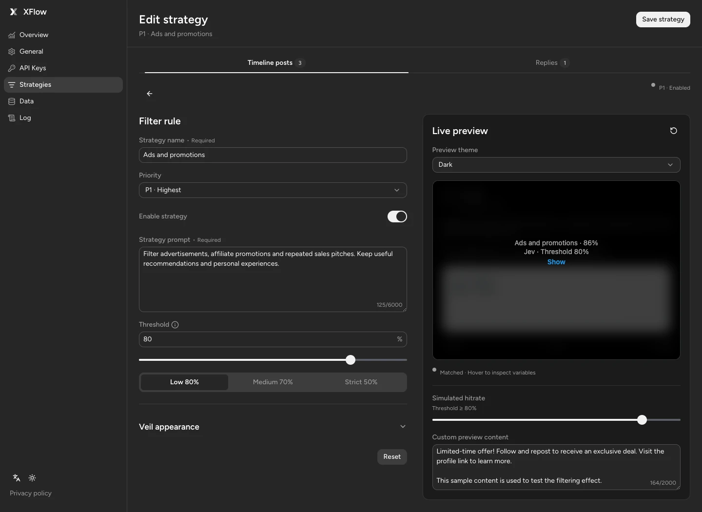
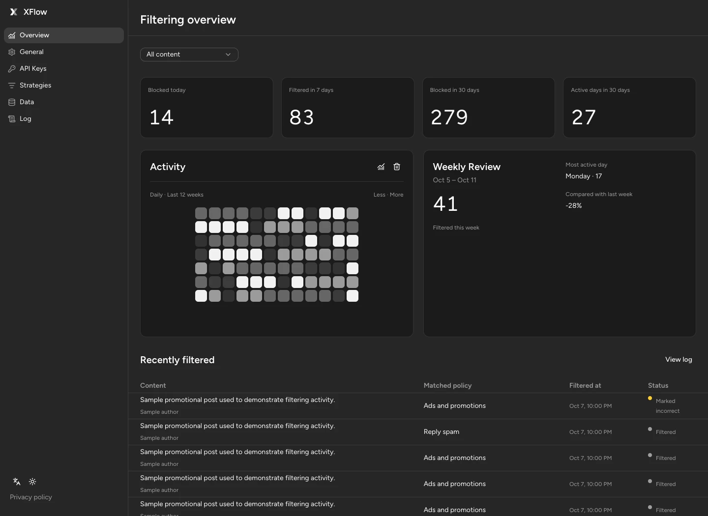
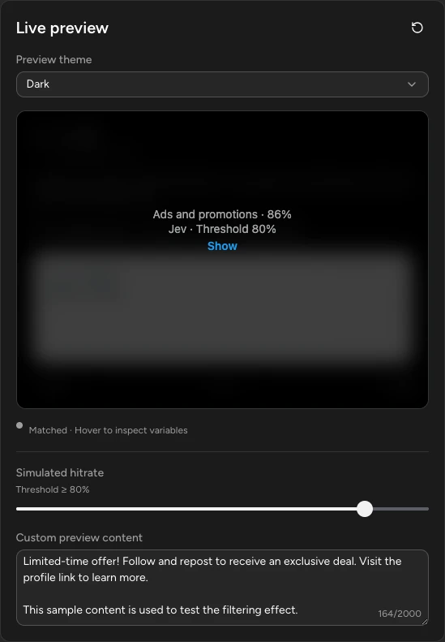
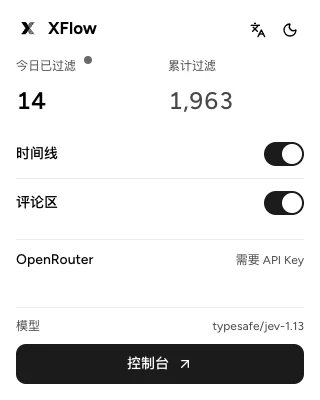
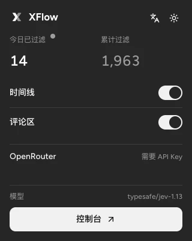

<a id="top"></a>

<p align="center">
  
</p>

<p align="center">
  <a href="#简体中文">简体中文</a> · <a href="#english">English</a>
</p>

<p align="center">
  <a href="https://github.com/ryanzen9/XFlow/actions/workflows/ci.yml"></a>
  
  
</p>

# 简体中文

- [界面预览](#zh-preview)
- [为什么是 XFlow](#zh-why-xflow)
- [工作方式](#zh-how-it-works)
- [从商店安装](#zh-install-store)
- [从源码安装（开发者）](#zh-install-source)
- [Provider](#zh-providers)
- [策略与交互](#zh-policies)
- [Activity、Badge 与数据保留](#zh-activity)
- [S3 同步](#zh-s3)
- [隐私与权限](#zh-privacy)
- [TypeSafe 实测效果（2026-09-23）](#zh-typesafe-results)
- [资源](#zh-resources)

<p align="center">
  Jev For your X：自定义过滤 X / Twitter 中的广告，情绪化，政治内容等内容。打造清爽的 X 浏览体验。
</p>

<p align="center">
  <a href="https://ryanzen9.github.io/XFlow/">项目官网</a> ｜ <a href="https://ryanzen9.github.io/XFlow/privacy.html">隐私政策</a> ｜
  <a href="https://chromewebstore.google.com/detail/xflow/jelihbmknilmpbgjjjcmcbchmjloghnj">Chrome 商店</a>
</p>

<a id="zh-preview"></a>

## 界面预览

<p align="center">
  
</p>

<table>
  <tr>
    <td width="72%"></td>
    <td width="28%"></td>
  </tr>
  <tr>
    <td align="center"><sub>独立概览：12 周 Activity、周报与近期记录</sub></td>
    <td align="center"><sub>不调用模型的过滤结果预览</sub></td>
  </tr>
</table>

<p align="center">
  
  
</p>

截图更新于 2026-10-07，使用生产界面与隔离模拟数据，不包含凭据，不调用 Provider。Popup 为简体中文，其余为英文界面。更多预览：[API Keys 与健康检查](docs/assets/provider-settings.webp) · [Jev 请求日志](docs/assets/jev-request-log.webp)。

<a id="zh-why-xflow"></a>

## 为什么是 XFlow

|      | 能力                      | 当前行为                                                                                 |
| ---- | ------------------------- | ---------------------------------------------------------------------------------------- |
| `01` | 快速精准                  | 基于 Jev 快速精准识别广告、推广、垃圾信息及诈骗诱导。                                    |
| `02` | 自定义策略                | 为时间线和评论区分别配置多条规则、提示词。                                               |
| `03` | 多渠道                    | 支持 OpenRouter、Vercel AI Gateway 或 TypeSafe 官方渠道。                                |
| `04` | 本地优先                  | 全部数据优先保存本机，源代码开源，确保用户隐私。Api Key 留存本机，坚决不入网。           |
| `05` | Versioned S3 sync         | 支持 S3 协议，跨设备同步状态。                                                           |
| `06` | Local credential boundary | Provider Key 与 S3 凭据只留在扩展本机存储，不进入 Content Script、配置 JSON 或 S3 文档。 |

<a id="zh-how-it-works"></a>

## 工作方式

```text
X / Twitter DOM
      │
      ▼
Content Script ── 标准化文本 ──► Background Service Worker
      │                                  │
      │                                  ├─ 策略编排与优先级
      │                                  └─ 当前选中的 Jev Provider
      │                                               │
      ◄──────── 命中概率 + 最终策略 ───────────────────┘
      │
      ▼
Blur Veil 状态机 ── Hover / Reveal / Re-obscure
      │
      └─ Filtered 事件 ──► Activity / Badge / 可选 S3 合并
```

Content Script 只负责发现帖子、提取必要文本与元数据、渲染遮罩和上报已实际过滤的事件。外部请求、密钥、迁移、Activity 去重和同步都留在后台 Service Worker。

<a id="zh-install-store"></a>

## 从商店安装

在 [Chrome Web Store 的 XFlow 页面](https://chromewebstore.google.com/detail/xflow/jelihbmknilmpbgjjjcmcbchmjloghnj) 点击“添加至 Chrome”，然后打开扩展的 Dashboard，在 **API Keys** 中保存至少一个 Provider Key 并设为当前渠道。打开或刷新 `https://x.com/home` 即可使用已启用的过滤策略。

<a id="zh-install-source"></a>

## 从源码安装（开发者）

要求：

- [Bun](https://bun.sh/) 1.3.13 或兼容版本
- Chrome、Edge 或其他支持 Manifest V3 的 Chromium 浏览器
- 至少一个受支持 Provider 的 API Key

```bash
git clone https://github.com/ryanzen9/XFlow.git
cd XFlow
bun install
bun run check
```

`bun run check` 会依次执行格式检查、Lint、TypeScript、Bun 测试和生产构建，产物位于 `dist/`。

然后：

1. 打开 `chrome://extensions` 并启用“开发者模式”。
2. 点击“加载已解压的扩展程序”，选择项目中的 `dist/`。
3. 打开 XFlow Dashboard，在 **API Keys** 中保存至少一个渠道凭证并设为当前渠道。
4. 打开或刷新 `https://x.com/home`。

每次重新构建后，需要在扩展管理页重新加载扩展，并刷新已打开的 X 页面。

<a id="zh-providers"></a>

## Provider

| 渠道              | 模型                | Adapter API                     |
| ----------------- | ------------------- | ------------------------------- |
| OpenRouter        | `typesafe/jev-1.13` | `@openrouter/sdk` Decisions API |
| Vercel AI Gateway | `typesafe-ai/jev`   | AI SDK `experimental_evaluate`  |
| TypeSafe          | `jev-latest`        | `@typesafe-ai/sdk` System One   |

渠道始终由用户明确选择。请求失败时，XFlow 不会自动将内容转发到另一个 Provider，以避免意外的数据流向或费用变化。

API Keys 页面可对每个渠道发起一次最小 Jev 健康检查，用于验证已保存密钥与接口是否可用。健康检查会产生一次真实 Provider 请求，可能计入第三方用量。

<a id="zh-policies"></a>

## 策略与交互

- 时间线和评论区拥有独立策略表，分别从 P1 开始排序。
- 第一条达到自身阈值的策略成为最终命中；高优先级未命中后才采用后续结果。
- Dashboard 的 Hit Rate 表示触发遮罩所需的最低命中概率，可用数字、滑块或低（80%）、中（70%）、严格（50%）快捷值调整；已有配置仍兼容旧的 `sensitivity` 字段。
- 保存策略会先平滑揭示受影响页面的旧遮罩，再按新配置重新分析，因此可能产生新的 API 请求。
- Hover 文案支持策略名称、hitrate、阈值、模型昵称、模型 ID 和页面场景变量。
- Hover 样式可在默认、文字强调和高对比之间切换，也可继续编辑自定义 CSS。
- 自定义 CSS 只接受列出的遮罩选择器和视觉属性，不会把任意页面 CSS 注入 X。

<a id="zh-activity"></a>

## Activity、Badge 与数据保留

- Popup 展示今日和累计过滤数；Toolbar Badge 只统计当前 Tab 当前页面生命周期内的唯一内容，0 时隐藏。
- Dashboard 提供过去 12 周 Heatmap、最近 7 天趋势、当前自然周回顾和最近 30 天筛选历史。
- 日志页同时保留最近 30 天、最多 200 条 Jev 请求元数据，包括渠道、模型、耗时、项目/问题数量与结果；不保存 API Key 或帖子正文，并可单独清除。后台启动及每日维护会移除过期记录。
- 只有明确选择 **Not supposed to be filtered** 才会标记错误；临时 Reveal 不会自动视为误判。
- 详细历史在 30 天后压缩；事件身份在 12 周后折叠为按设备合并的紧凑计数，以维持累计值并限制存储增长。
- 日志页可单独清理作者、内容预览、原文链接和命中策略，保留每日统计与累计数量。
- 全部清除会写入 `clearedAt` 墓碑，避免旧设备或远程对象恢复已清除记录。

<a id="zh-s3"></a>

## S3 同步

S3 使用 path-style URL：`{endpoint}/{bucket}/{objectKey}`。首次保存 Endpoint 时扩展会请求可选主机权限；启用后会在配置写入、浏览器启动和每 15 分钟定时检查时同步。生产清单只声明 `https://*/*`，因此使用 `http://localhost` 或 `http://127.0.0.1` 的本地 S3 需要先执行 `bun run build:dev`。

- 本地配置版本更新或远程对象不存在：推送本地配置。
- 远程配置版本更新：拉取并应用远程配置。
- Activity 在任一方向都按稳定内容 ID 合并；归档计数按设备取最大值，状态按 `Filtered → Revealed → Marked Incorrect` 单调合并。

用户标注、用户创建的模板/语义规则和作者规则属于长期知识，会随配置文档同步；多设备合并按标注 ID 取并集，同一标注按 `updatedAt` 与设备 ID 决定最后写入。配置版本与知识修订号独立推进，知识更新不会让旧配置覆盖其他设备上的新策略。普通 Jev 缓存、语义向量和临时运行状态只保存在本机 IndexedDB，不上传 S3，也不参与实时过滤请求。

Bucket 需要允许扩展来源执行 GET、PUT 和 CORS 预检。

<a id="zh-privacy"></a>

## 隐私与权限

完整说明见 [XFlow 隐私政策](https://ryanzen9.github.io/XFlow/privacy.html)（[English](https://ryanzen9.github.io/XFlow/privacy-en.html)；[仓库源文件](docs/privacy-policy.md)）。

<a id="zh-typesafe-results"></a>

## TypeSafe 实测效果（2026-09-23）

一次 `jev-latest` 实测使用 24 条冷样本和 3 轮 warm 探针，结果如下：

| 指标            |                                                 实测结果 |
| --------------- | -------------------------------------------------------: |
| 冷阶段          |                                   5 次 SDK 批次，2.44 秒 |
| warm 阶段       |                  72/72 本地缓存命中，平均每轮 6.009 毫秒 |
| 避免的 SDK 调用 |          15/20（75%）；warm 阶段的 15 次预期调用全部避免 |
| 预期缓存层命中  | Exact、Normalized、Template、Semantic 均为 18/18（100%） |
| 延迟变化        |                        冷阶段与 warm 单轮相比减少 99.75% |
| 缓存载荷        |                          增加约 101.20 KiB，共 92 条记录 |

这些数据来自一次实测，用于展示缓存预热后的收益，不代表所有 Provider 延迟。`Traffic-type accuracy` 衡量探针是否命中预期缓存层，不代表模型分类准确率；本轮 `blur` / `allow` 分布和 56.9% 平均概率也没有人工标签作为正确性基准。报告中的 3.5% 是缓存载荷相对 2.86 MiB 运行时扩展文件的比例；缓存字节数为序列化载荷估算，不等同于浏览器实际磁盘占用。

未设置 `TYPESAFE_API_KEY` 时，交互式终端会隐藏输入 Key；CI 可使用环境变量传入。Key 只存在于当前进程内存，不会打印、保存到扩展存储或写入报告。不要使用 `--key=...`，以免密钥进入 Shell 历史或进程列表。报告包含各类型命中率、SDK 调用减少率、真实延迟、构建包逻辑体积，以及缓存 IndexedDB 序列化载荷的前后变化；浏览器文件系统开销会因平台而异。`--posts=20..50` 仍作为 `--samples` 的兼容别名，`--json` 可输出机器可读结果。

Dashboard 预览使用隔离的 localStorage Mock，不读取已安装扩展的数据，也不会请求模型。设计 token 索引页位于 `http://127.0.0.1:43993/`，可切换 Light / Dark 并查看解析值。
<a id="zh-resources"></a>

## 资源

- [隐私政策 · 简体中文](docs/privacy-policy.md) · [English](docs/privacy-policy.en.md)

[返回顶部](#top) · [English](#english)

---

# English

- [Preview](#en-preview)
- [Why XFlow](#en-why-xflow)
- [How it works](#en-how-it-works)
- [Install from the Chrome Web Store](#en-install-store)
- [Install from source (developers)](#en-install-source)
- [Providers](#en-providers)
- [Policies and interaction](#en-policies)
- [Activity, badge, and retention](#en-activity)
- [S3 synchronization](#en-s3)
- [Privacy and permissions](#en-privacy)
- [TypeSafe results (2026-09-23)](#en-typesafe-results)
- [Resources](#en-resources)

<p align="center">
  Jev For your X: customize filtering of ads, emotional content, political content, and more on X / Twitter. Enjoy a cleaner X browsing experience.
</p>

<p align="center">
  <a href="https://ryanzen9.github.io/XFlow/">Project website</a> · <a href="https://ryanzen9.github.io/XFlow/privacy-en.html">Privacy policy</a> ·
  <a href="https://chromewebstore.google.com/detail/xflow/jelihbmknilmpbgjjjcmcbchmjloghnj">Chrome Web Store</a>
</p>

<a id="en-preview"></a>

## Preview

<p align="center">
  
</p>

<table>
  <tr>
    <td width="72%"></td>
    <td width="28%"></td>
  </tr>
  <tr>
    <td align="center"><sub>Overview: 12-week Activity, weekly review and recent records</sub></td>
    <td align="center"><sub>A local filtering result preview that never calls a model</sub></td>
  </tr>
</table>

<p align="center">
  
  
</p>

Updated October 7, 2026 from the production UI using isolated sample data without credentials or provider calls. Popup captures use Simplified Chinese; other captures use English. More previews: [API Keys and health checks](docs/assets/provider-settings.webp) · [Jev request log](docs/assets/jev-request-log.webp).

<a id="en-why-xflow"></a>

## Why XFlow

|      | Capability                | Current behavior                                                                                                                           |
| ---- | ------------------------- | ------------------------------------------------------------------------------------------------------------------------------------------ |
| `01` | Fast and accurate         | Jev quickly and accurately identifies ads, promotions, spam, and scams.                                                                    |
| `02` | Custom policies           | Configure separate rules and prompts for timelines and replies.                                                                            |
| `03` | Multiple providers        | Supports OpenRouter, Vercel AI Gateway, and the official TypeSafe provider.                                                                |
| `04` | Local first               | All data is stored locally first, and the source code is open to protect user privacy. API keys stay on the device and are never uploaded. |
| `05` | Versioned S3 sync         | Supports the S3 protocol to synchronize state across devices.                                                                              |
| `06` | Local credential boundary | Keep provider keys and S3 credentials in extension-local storage, outside Content Scripts, editable JSON, and S3 documents.                |

<a id="en-how-it-works"></a>

## How it works

```text
X / Twitter DOM
      │
      ▼
Content Script ── normalized text ──► Background Service Worker
      │                                      │
      │                                      ├─ policy orchestration
      │                                      └─ selected Jev provider
      │                                                   │
      ◄──────── probability + matched policy ─────────────┘
      │
      ▼
Blur Veil state machine ── Hover / Reveal / Re-obscure
      │
      └─ Filtered event ──► Activity / Badge / optional S3 merge
```

The Content Script only discovers posts, extracts the minimum required text and metadata, renders the veil, and reports events that actually entered the filtered state. External requests, credentials, migrations, activity deduplication, and synchronization remain in the background Service Worker.

<a id="en-install-store"></a>

## Install from the Chrome Web Store

Select **Add to Chrome** on the [XFlow store page](https://chromewebstore.google.com/detail/xflow/jelihbmknilmpbgjjjcmcbchmjloghnj). Then open the Dashboard, save a supported provider key under **API Keys**, and select that provider. Open or refresh `https://x.com/home` to use enabled filtering strategies.

<a id="en-install-source"></a>

## Install from source (developers)

Requirements:

- [Bun](https://bun.sh/) 1.3.13 or a compatible release
- Chrome, Edge, or another Manifest V3 Chromium browser
- An API key for at least one supported provider

```bash
git clone https://github.com/ryanzen9/XFlow.git
cd XFlow
bun install
bun run check
```

`bun run check` runs formatting checks, linting, TypeScript, Bun tests, and the production build. Output is written to `dist/`.

Then:

1. Open `chrome://extensions` and enable **Developer mode**.
2. Select **Load unpacked** and choose the project's `dist/` directory.
3. Open the XFlow Dashboard, save at least one credential under **API Keys**, and select that provider.
4. Open or refresh `https://x.com/home`.

After rebuilding, reload the extension from the extensions page and refresh any open X tabs.

<a id="en-providers"></a>

## Providers

| Provider          | Model               | Adapter API                     |
| ----------------- | ------------------- | ------------------------------- |
| OpenRouter        | `typesafe/jev-1.13` | `@openrouter/sdk` Decisions API |
| Vercel AI Gateway | `typesafe-ai/jev`   | AI SDK `experimental_evaluate`  |
| TypeSafe          | `jev-latest`        | `@typesafe-ai/sdk` System One   |

The active provider is always an explicit user choice. XFlow does not silently forward content to another provider after a failure, avoiding unexpected data routing or cost changes.

The API Keys page can send a minimal Jev health check to each provider to verify the saved credential and endpoint. This is a real provider request and may count toward third-party usage or charges.

<a id="en-policies"></a>

## Policies and interaction

- Timelines and replies have independent policy queues, each ordered from P1.
- The first policy whose probability reaches its own threshold wins; lower-priority results are considered only after higher-priority misses.
- Dashboard Hit Rate is the minimum match probability needed to veil a post. Adjust it with a number, slider, or Low (80%), Medium (70%), and Strict (50%) presets. Existing settings remain compatible with the legacy `sensitivity` field.
- Saving a policy first reveals existing veils smoothly, then re-evaluates affected content with the new configuration. This may create new API requests.
- Hover templates can reference the policy name, hit rate, threshold, model nickname, model ID, and surface.
- Switch Hover styles between Default, Text emphasis, and High contrast, or keep editing custom CSS.
- Custom CSS is restricted to documented veil selectors and visual properties; arbitrary page CSS is never injected into X.

<a id="en-activity"></a>

## Activity, badge, and retention

- The Popup shows today's and all-time filter totals. The toolbar badge counts unique content only for the current page lifecycle in the current tab and stays hidden at zero.
- The Dashboard provides a 12-week heatmap, seven-day trend, current calendar-week review, and 30 days of filter history.
- The Log page also keeps up to 200 Jev request metadata entries for 30 days, including provider, model, duration, item/question counts, and outcome. It never stores API Keys or post text, can be cleared separately, and prunes expired records at background startup and during daily maintenance.
- An event is marked incorrect only after **Not supposed to be filtered** is explicitly selected. A temporary reveal is not automatically treated as a mistake.
- Detailed history is compacted after 30 days. Event identity is folded into compact per-device counts after 12 weeks, retaining all-time totals while bounding storage.
- The Log page can clear authors, content previews, original links, and matched strategies while retaining daily statistics and all-time totals.
- Clearing activity writes a `clearedAt` tombstone so an older device or remote object cannot restore deleted records.

<a id="en-s3"></a>

## S3 synchronization

S3 uses a path-style URL: `{endpoint}/{bucket}/{objectKey}`. XFlow requests optional host access when an endpoint is first saved. Once enabled, it synchronizes after config writes, at browser startup, and every 15 minutes. The production manifest only declares `https://*/*`, so a local S3 endpoint on `http://localhost` or `http://127.0.0.1` requires `bun run build:dev` first.

- A newer local config, or a missing remote object, pushes the local document.
- A newer remote config is pulled and applied.
- Activity merges by stable content ID in either direction. Archived counts use the per-device maximum, and status advances monotonically through `Filtered → Revealed → Marked Incorrect`.

User feedback, user-created template/semantic rules, and author rules are durable knowledge synchronized with the configuration document. Multi-device merges take the union by feedback ID; conflicts for the same feedback entry are resolved by `updatedAt` and device ID. Configuration versions and knowledge revisions advance independently, so knowledge updates cannot cause an older configuration to overwrite newer policies on another device. Regular Jev cache entries, semantic vectors, and temporary runtime state remain in local IndexedDB. They are not uploaded to S3 or included in real-time filtering requests.

The bucket must allow GET, PUT, and CORS preflight requests from the extension origin.

<a id="en-privacy"></a>

## Privacy and permissions

See the full [XFlow Privacy Policy](https://ryanzen9.github.io/XFlow/privacy-en.html) ([简体中文](https://ryanzen9.github.io/XFlow/privacy.html); [source](docs/privacy-policy.en.md)).

<a id="en-typesafe-results"></a>

## TypeSafe results (2026-09-23)

One live run with `jev-latest`, 24 cold samples, and three warm rounds produced these results:

| Metric               |                                                               Observed |
| -------------------- | ---------------------------------------------------------------------: |
| Cold phase           |                                                5 SDK batches in 2.44 s |
| Warm phase           |                     72/72 local cache hits; 6.009 ms average per round |
| SDK calls avoided    |     15/20 (75%); all 15 calls expected during warm rounds were avoided |
| Intended cache layer | Exact, Normalized, Template, and Semantic each hit 18/18 probes (100%) |
| Latency change       |                    99.75% lower for one warm round than the cold phase |
| Cache payload        |                               About 101.20 KiB added across 92 records |

These figures come from one run and demonstrate the benefit after cache seeding; they do not predict latency for every provider run. “Traffic-type accuracy” measures whether probes reached their intended cache layer, not model classification accuracy. The `blur` / `allow` split and 56.9% average probability have no human-labeled ground truth in this benchmark. The reported 3.5% compares the cache payload with the 2.86 MiB runtime extension assets; serialized payload bytes are an estimate, not browser disk usage.

An interactive terminal prompts for the key with hidden input when `TYPESAFE_API_KEY` is unset; CI may supply that environment variable. The key stays in process memory and is never printed, persisted, or written to reports. Do not use a `--key=...` argument, which could leak through shell history or process listings. The report includes per-traffic hit rates, avoided SDK calls, measured latency, logical build-package size, and the before/after serialized IndexedDB cache payload estimate; browser filesystem overhead varies by platform. `--posts=20..50` remains a compatibility alias for `--samples`, and `--json` is supported.

The Dashboard preview uses an isolated localStorage mock. It does not read installed extension data or call a model. The token index is served at `http://127.0.0.1:43993/` and exposes resolved values in both Light and Dark themes.

<a id="en-resources"></a>

## Resources

- [Privacy policy · English](docs/privacy-policy.en.md) · [简体中文](docs/privacy-policy.md)

[Back to top](#top) · [简体中文](#简体中文)
