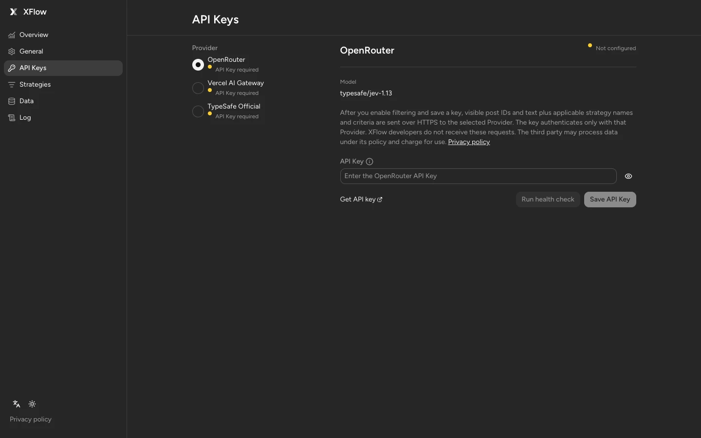
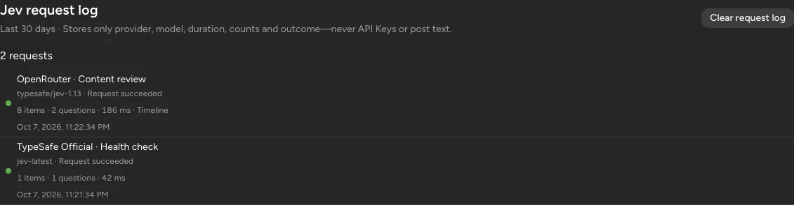

# XFlow 0.1.1 · 界面与发布预览

2026-10-07 更新。界面来自 `df27ee8`（PR #15），已合并最新 `main`：`129ad07`。版本仍为 **0.1.1**；这些素材用于文档和商店更新准备。准确时间、完整提交号及每张图片的 SHA-256 见 [预览清单](0.1.1.json)。

## 版本更新内容

- Astryx Neutral 界面、Figtree 字体和更紧凑的 Popup，提供明暗主题。
- 独立过滤概览，展示指标、12 周 Activity、周报和近期记录。
- 策略页调整列宽、点击区域和窄屏布局；编辑器提供本机遮罩预览。
- API Keys 新增主动健康检查；日志页新增可单独清除的 Jev 请求诊断。
- 请求诊断只保存渠道、模型、耗时、数量与结果，最多 30 天或 200 条，不同步 S3。健康检查可能产生 Provider 用量。

## 文档图片

| 图片                                           | 尺寸        | 语言 / 主题      | 用途                             |
| ---------------------------------------------- | ----------- | ---------------- | -------------------------------- |
| [策略编辑器](../assets/strategy-editor.webp)   | 1440 × 1050 | English / Dark   | 两份 README 与官网 Hero 共用     |
| [过滤概览](../assets/dashboard-activity.webp)  | 1440 × 1050 | English / Dark   | 指标、热力图、周报、近期记录     |
| [遮罩预览](../assets/veil-preview.webp)        | 549 × 791   | English / Dark   | 本机模拟命中与可编辑示例         |
| [Popup · Light](../assets/popup-light.webp)    | 320 × 400   | 简体中文 / Light | 今日与累计计数、监控开关、入口   |
| [Popup · Dark](../assets/popup-dark.webp)      | 320 × 400   | 简体中文 / Dark  | 同一布局的深色主题               |
| [API Keys](../assets/provider-settings.webp)   | 1440 × 900  | English / Dark   | 渠道选择、密钥输入与健康检查入口 |
| [Jev 请求日志](../assets/jev-request-log.webp) | 1131 × 294  | English / Dark   | 请求元数据与独立清理操作         |

<p>
  
  
</p>





图片由生产 `dist/` 界面渲染，使用隔离模拟数据。作者、帖子、统计、策略和请求日志均为示例；没有 Provider / S3 凭据，也不调用 Provider。未配置渠道的健康检查按钮会禁用。遮罩命中和请求日志里的成功结果均为本机模拟。

## 商店上传顺序

文件保存在忽略的 `output/previews/0.1.1/store/`，三张均为 **1280 × 800 PNG、英文、深色主题**，符合 [Chrome 商店截图尺寸要求](https://developer.chrome.com/docs/webstore/cws-dashboard-listing#graphic-assets)。

| 顺序 | 文件                        | 内容                                                                    |
| ---- | --------------------------- | ----------------------------------------------------------------------- |
| 1    | `01-popup.png`              | Astryx 展示框中的真实 320 × 400 Popup；标注 Sample data / Local preview |
| 2    | `02-activity-dashboard.png` | 独立过滤概览、Activity 热力图与周报                                     |
| 3    | `03-strategy-and-veil.png`  | 策略规则、阈值和本机遮罩预览                                            |

`output/previews/0.1.1/xflow-0.1.1-store-previews.zip` 包含这三张图片、已有商店图标、小宣传图、上传说明和校验清单。英文素材用于英文或全局截图栏。原始 PNG 与上传包不提交 Git；用户要求更新的文档 WebP 和文字清单保存在仓库中。

[商店资料目录](../chrome-web-store/README.md)提供中英文更新文案和提交字段。[2026-09-30 发布包 QA](../chrome-web-store/qa-0.1.1.md)只对应其记录的历史 ZIP；本次截图更新不表示新 ZIP 已验证或商店已发布。

## 重新生成

需要本机可执行的 `agent-browser`（及其 Chromium）、`cwebp`、`webpinfo` 和 `zip`。

```sh
bun run preview:assets
bun run check
```

命令先构建生产扩展，再启动独立预览服务。默认端口 `43998`，可用 `PREVIEW_ASSETS_PORT` 修改。每张图片使用独立浏览器会话、预先写入模拟状态并启用 reduced motion；截图完成后关闭会话和服务。`cwebp` 只负责格式编码，图片内容由浏览器直接渲染。

产物为 `docs/assets/*.webp`、`docs/previews/<version>.json` 和忽略的 `output/previews/<version>/`。脚本随 `package.json` 的版本命名输出；日期和相对时间使用拍摄当天。检查生成的每张图，尤其是滚动容器里的日志区域，然后同步本页尺寸、商店目录和更新文案。官网通过 `bun run build:site` 复制同一策略编辑器图。
